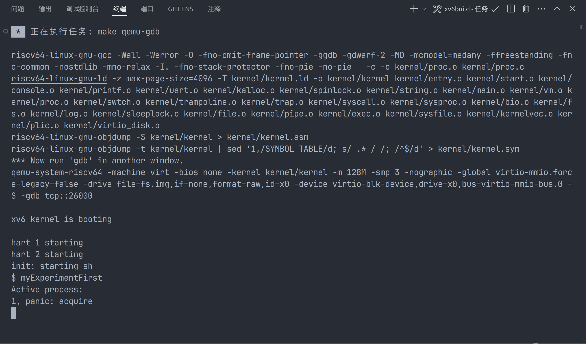

# 实验一
## 实验任务:
在RISC-V体系结构上运行的xv6操作系统中引入一个新的系统调用，该调用执行一个简单任务，比如返回系统中当前进程的数量。
## 实验目的:
理解xv6中系统调用的工作原理。
### 实验步骤：
1. user.h定义函数头：作为用户进程实现系统调用的接口，这种函数接口即为系统调用,目的是调用处在内核文件下的函数
```c
int getprocs(void);// first experiment---first operation
```

2. 在sysproc.c的文件中实现sys_getprocs函数来实现系统调用
```c
// first experiment---second operation
int
sys_getprocs(void)
{
  return getprocs();
}
```
在sys_getprocs函数中不会直接实现想要的功能，而是通过调用内核中的一个普通函数来实现封装性，所以接下来我们需要在内核文件中定义getprocs()来实现我们想要的功能

3. 在内核文件下的def.h定义getprocs()的函数头
```c
int             getprocs(void); // first experiment---fourth operation   
```

4. 接下来我们在内核文件夹下新建proc.c文件来实现真正的功能
```c
// first experiment---fourth operation
int
getprocs(void)
{
  static char *states[] = {
    [UNUSED]    "unused",
    [USED]      "used",
    [SLEEPING]  "sleeping",
    [RUNNABLE]  "runnble",
    [RUNNING]   "run",
    [ZOMBIE]    "zombie"
  };
  struct proc *p;
  char *state;
  int num = 0;
  printf("Active process:");
  printf("\n");
  for (p = proc; p < &proc[NPROC]; p++)
  {
    acquire(&p->lock);
    if (p->state == RUNNABLE || p->state == RUNNING || p->state == SLEEPING || p->state == ZOMBIE)
    {
      num++;
      state = states[p->state];
      printf("%d, %s, %s", p->pid, state, p->name);
      printf("\n");
    }
    release(&p->lock);
  }
  return num;
}
```
这里最开始写的时候犯了一个错误，我想把处于活跃状态的进程的具体状态打印出来，但是当时没有注意到state的类型是enum
```c
    printf("%d,%s,%s",p->pid,p->state,p->name);
```
报错为：

最后发现state的类型是enum而不是数组，不能直接打印在控制台上
state的定义：
```c
enum procstate { UNUSED, USED, SLEEPING, RUNNABLE, RUNNING, ZOMBIE };

// Per-process state
struct proc {
  struct spinlock lock;

  // p->lock must be held when using these:
  enum procstate state;        // Process state
  void *chan;                  // If non-zero, sleeping on chan
  int killed;                  // If non-zero, have been killed
  int xstate;                  // Exit status to be returned to parent's wait
  int pid;                     // Process ID
  ...
}
```
所以我们要将enum类型转化为数组类型：
```c
  static char *states[] = {
    [UNUSED]    "unused",
    [USED]      "used",
    [SLEEPING]  "sleep",
    [RUNNABLE]  "runnble",
    [RUNNING]   "run",
    [ZOMBIE]    "zombie"
  };
```

5. 在实现完功能后我们要为新添加的系统调用定义一个唯一的调用号,在syscall.h文件中增加
```c
#define SYS_getprocs 22 // first experiment---fifth operation
```

6. 接下来我们要更新syscall.c文件，让它根据我们定义的调用号来进行调用
```c
extern uint64 sys_getprocs(void); // first experiment---sixth operation
```

```c
static uint64 (*syscalls[])(void) = {
[SYS_fork]    sys_fork,
[SYS_exit]    sys_exit,
[SYS_wait]    sys_wait,
[SYS_pipe]    sys_pipe,
[SYS_read]    sys_read,
[SYS_kill]    sys_kill,
[SYS_exec]    sys_exec,
[SYS_fstat]   sys_fstat,
[SYS_chdir]   sys_chdir,
[SYS_dup]     sys_dup,
[SYS_getpid]  sys_getpid,
[SYS_sbrk]    sys_sbrk,
[SYS_sleep]   sys_sleep,
[SYS_uptime]  sys_uptime,
[SYS_open]    sys_open,
[SYS_write]   sys_write,
[SYS_mknod]   sys_mknod,
[SYS_unlink]  sys_unlink,
[SYS_link]    sys_link,
[SYS_mkdir]   sys_mkdir,
[SYS_close]   sys_close,
[SYS_getprocs] sys_getprocs, // first experiment---seventh operation
};
```
将系统调用号与系统调用的实现函数进行映射

7. 接下来我们要在usys.pl实现用户控件的映射
```perl
entry("getprocs");  # first experiment---eighth operation
```
它将生成usys.S中对应的汇编代码
```S
getprocs:
 li a7, SYS_getprocs
 ecall
 ret
```

8. 然后自己编写一个测试文件，在user下叫做myExperimentFirst.c
```c
// first experiment---nineth operation
#include "kernel/types.h"
#include "user/user.h"

int main(int argc, char const *argv[])
{
    int count = getprocs();
    printf("Number of active processes: %d\n", count);
    exit(0);
}
```

9. 再对Makefile文件进行修改
```makefile
#first experiment---tenth operation
UPROGS=\
	$U/_cat\
	$U/_echo\
	$U/_forktest\
	$U/_grep\
	$U/_init\
	$U/_kill\
	$U/_ln\
	$U/_ls\
	$U/_mkdir\
	$U/_rm\
	$U/_sh\
	$U/_stressfs\
	$U/_usertests\
	$U/_grind\
	$U/_wc\
	$U/_zombie\
	$U/_myExperimentFirst\
```

10. 重新编译内核并测试


11. 对系统调用的解释：
```c
// syscall.c
void
syscall(void)
{
  int num;
  struct proc *p = myproc();

  num = p->trapframe->a7;
  if(num > 0 && num < NELEM(syscalls) && syscalls[num]) {
    // Use num to lookup the system call function for num, call it,
    // and store its return value in p->trapframe->a0
    p->trapframe->a0 = syscalls[num]();
  } else {
    printf("%d %s: unknown sys call %d\n",
            p->pid, p->name, num);
    p->trapframe->a0 = -1;
  }
}
```
在上述函数代码中，我们首先定义一个进程控制块的指针p，并将p指向myproc函数所获取的进程控制块信息，根据myproc()的函数体我们可以得出myproc()函数的返回值为当前正在CPU上运行的进程的进程控制块的相关信息
```c
myproc(void)
{
  push_off();
  struct cpu *c = mycpu();
  struct proc *p = c->proc;
  pop_off();
  return p;
}
```
p指针会指向一个名为trapframe(中文译为“陷阱框架”)的结构，其中保存了对应的寄存器号，查阅相关资料并结合计算机组成原理中所学的知识可知，a7寄存器中的存储内容一般为系统调用的编号，而a0寄存器中的存储内容一般为(系统调用的)返回值。
因此接下来一部分代码的功能为，将当前正在占用处理机的进程对应的系统调用号赋值给num，之后判断num的数值是否可以在上述syscalls[]的数组中被映射为对应的函数，如果可以映射，即将调用映射出来的函数的返回值赋值给当前运行进程的a0寄存器，即最终完成系统调用功能，否则输出错误进程信息并将系统调用返回值赋值为-1。