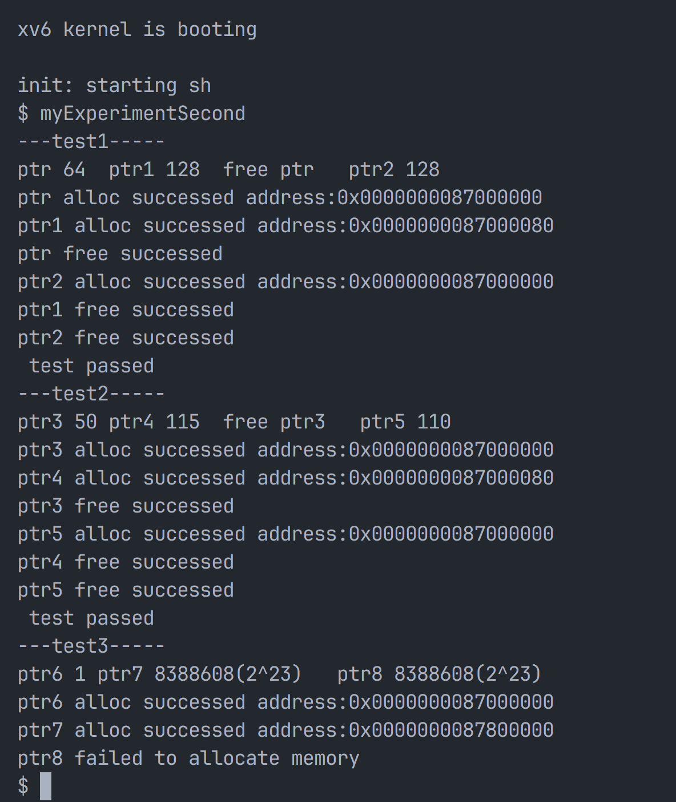

# 实验二
## 实验任务
动态内存分配器的实现（内核空间），在这个任务中，我希望实现在xv6操作系统的内核空间中设计并实现一个基于伙伴系统的动态内存分配器，从而实现对内存的动态分配与释放
## 实验目的
认识和实践xv6操作系统内存管理方法。通过设计和实现类似malloc的动态内存分配器，理解操作系统如何处理内存分配和回收，以及如何动态处理不同大小内存块的请求
### 实验步骤
1. 总体构思：我们可以使用一个数组来存储不同大小块的空闲链表作为伙伴数组，数组的每一个索引对应一种块大小，每个条目指向其对应大小的空闲块链表，最小化内核操作的延迟，并且设计应利用伙伴系统的自然合并特性，有效减少内存碎片
2. 定义全局变量：区域空间大小大约是16MB
```c
#define MAX_ORDER 24  // 最大的阶数
#define START 0x87000000  // 起始虚拟地址
#define END 0x88000000    // 终止虚拟地址
typedef unsigned long uintptr_t; // 指针类型
``` 
3. 数据结构定义:
结构体定义包括两个部分，分别是buddy和buddy_list的定义
buddy表示一个内存块，其中包含块的大小和指向下一个同大小内存块的指针，代码如下：
```c
struct buddy {
    int size;  // 内存块的大小
    struct buddy *next;  // 指向下一个同大小的内存块
    struct spinlock lock; // 用于保护块的访问
}
```

buddy_list管理多个伙伴数组，每个阶级的空闲内存块都用一个链表管理。链表数组free_list索引对应不同大小的内存块，使用伙伴系统特性分组，代码如下：
```c
struct buddy_list {
    struct buddy *free_list[MAX_ORDER + 1];  // 每个阶的空闲块链表
    struct spinlock lock; // 用于保护链表的访问
};
```
4. 初始化伙伴系统:
buddy_system_init()初始化伙伴系统，为每个CPU核心分配一个伙伴列表buddy_list，并初始化这些列表和相应的锁。这个函数主要在系统启动时调用，为内核内存管理做准备。
```c
static struct buddy_list *bl[NCPU]; //指向每个CPU的buddy_list结构体的指针数组。NCPU是系统中CPU的数量

void
buddy_system_init()
{
    //为每一个CPU分配一个buddy_list
    for (int i = 0; i < NCPU; i++)
    {
        bl[i] = (struct buddy_list *)kalloc();
        // 分配失败 打印错误信息并退出
        if (bl[i] == 0)
        {
            panic("buddy_list alloc failed");
        }

        // 初始化每个阶的空闲块链表
        for (int j = 0; j <= MAX_ORDER; j++)
        {
            bl[i]->free_list[j] = NULL;
        }

        // 初始化锁
        initlock(&bl[i]->lock, "buddy_list_lock");
    }
}
```
buddy_init()设置特定核心的伙伴系统初始内存块。我这里先让它预先分配了一个最大阶的内存块，即memory所指向的内存区
```c
void* memory = (void*)START; //指向分配器起始地址的指针

void 
buddy_init()
{
    // 初始化一个最大阶的空闲块链表
    int order = MAX_ORDER;

    // 将内存块添加到空闲列表中，设置内存块的大小和下一个块指针
    bl[cpuid()]->free_list[order] = (struct buddy *)memory;
    bl[cpuid()]->free_list[order]->size = 1 << order;
    bl[cpuid()]->free_list[order]->next = NULL;

    // 初始化其他所有阶的空闲块链表
    for (int i = 0; i < order; i++) {
        bl[cpuid()]->free_list[i] = NULL;
    }
}
```

5. 实现内存分配函数
首先是需要确定请求的内存块大小阶级，通过计算2的幂次最小能覆盖参数size的值来确定。接下来需要查找并分配适当大小的内存块，请求的阶级开始向上查找，直到找到一个可用的块。如果找到的块比所需阶级大，则进行分割，直到块的大小与请求阶级相匹配，这时返回分配的内存块的指针

总体时间复杂度为O(logn)
```c
void
*buddy_alloc(int size)
{
    int order = 0;
    // 找到最小的阶数，使得2^order >= size
    while ((1 << order) < size) order++;
    // 获取当前CPU的锁，防止多个CPU同时访问
    acquire(&bl[cpuid()]->lock);

    // 查找第一个非空足够大的空闲块
    for (int i = order; i <= MAX_ORDER; i++)
    {
        if (bl[cpuid()]->free_list[i] != NULL)
        {
            // 从空闲块链表中移除块
            struct buddy *block = bl[cpuid()]->free_list[i];
            bl[cpuid()]->free_list[i] = block->next;

            // 检查这个块是否比所需的大
            while (i > order) 
            {
                i--;
                // 每次将块分成两个更小的块
                struct buddy *new_block = (struct buddy *)((char *)block + (1 << i));
                new_block->size = 1 << i;
                new_block->next = bl[cpuid()]->free_list[i];
                // 将新块添加到空闲块链表中
                bl[cpuid()]->free_list[i] = new_block;
            }
            // 释放锁并返回块
            release(&bl[cpuid()]->lock);
            return (void *)block;
        }
    }
}
```

6. 实现内存分配函数
我们首先是需要确定释放内存的大小阶级，与内存分配函数同理，同样是计算2的幂次。
然后尝试合并伙伴块，计算当前释放内存块的伙伴地址，查看是否也在空闲列表中。如果找到伙伴并且也是空闲的，则从空闲列表中移除伙伴块，合并当前块和伙伴块，形成一个更大的块。
并且一直重复合并过程，直到不能再合并为止，也就是没有找到伙伴或伙伴不空闲。最后将可能经过多次合并最终块放回空闲列表

时间复杂度是O(logn)
```c
// 回收不再使用的内存块，并尝试合并伙伴块,减少内存碎片
void
buddy_free(void* memory,int size)
{
    int order = 0;
    while ((1 << order) < size) order++;// 循环直到找到一个足够大以容纳size的order
    struct buddy *block = (struct buddy *)memory;
    block->size = 1 << order;
    
    acquire(&bl[cpuid()]->lock);

    for (int i = order; i < MAX_ORDER; i++)
    {
        uintptr_t buddy_addr = (uintptr_t)memory ^ (1 << i);// 计算伙伴块的地址
        struct buddy *prev = NULL, *curr = bl[cpuid()]->free_list[i];//find

        while (curr != NULL) 
        {
            // 如果找到伙伴块，则合并两个块
            if ((uintptr_t)curr == buddy_addr) 
            {
                if (prev) // 说明当前块不是表头
                {
                    prev->next = curr->next;
                } else {
                    bl[cpuid()]->free_list[i] = curr->next;
                }
                // 合并操作还需要检查两个块的地址，保证合并后的块的地址是较小的那个
                if((uintptr_t)memory>buddy_addr)
                {
                    uintptr_t tmp = (uintptr_t)memory;
                    memory = (void *)buddy_addr;
                    buddy_addr = tmp;
                }
                
                order++; // 合并后的块的阶数增加1
                block = (struct buddy *)memory;
                block->size = 1 << order;// 合并
                break;// 找到并处理了伙伴块，退出循环
            }
            prev = curr;
            curr = curr->next;
        }

        if (curr == NULL) break;
    }

    block->next = bl[cpuid()]->free_list[order];
    bl[cpuid()]->free_list[order] = block;
    release(&bl[cpuid()]->lock);
}
```

7. 测试代码：
```c
int test1()
{
  printf("---test1-----\n");
  printf("ptr 64  ptr1 128  free ptr   ptr2 128\n");
  char* ptr = (char*)buddy_alloc(64);
    if(ptr == 0) 
    {
      printf("test_malloc failed to allocate memory\n");
      exit(0);
    }
    printf("ptr alloc successed address:%p\n",ptr);
    char* ptr1 = (char*)buddy_alloc(128);
    if(ptr1 == 0) 
    {
      printf("test_malloc failed to allocate memory\n");
      exit(0);
    }
  printf("ptr1 alloc successed address:%p\n",ptr1);
  test_memory(ptr, 64,0xA);
  buddy_free(ptr,64);
  printf("ptr free successed\n");

  char* ptr2 = (char*)buddy_alloc(128);
    if(ptr2 == 0) 
    {
        printf("test_malloc failed to allocate memory\n");
        exit(0);
    }
    printf("ptr2 alloc successed address:%p\n",ptr2);
    test_memory(ptr1, 128, 0xA);
    buddy_free(ptr1,128);
    printf("ptr1 free successed\n");
    test_memory(ptr2, 128, 0xB);
    buddy_free(ptr2,128);
    printf("ptr2 free successed\n");
    // 其他测试添加在此处
    printf(" test passed\n");


  printf("---test2-----\n");
  printf("ptr3 50 ptr4 115  free ptr3   ptr5 110\n");
  char* ptr3 = (char*)buddy_alloc(50);
    if(ptr3 == 0) 
    {
      printf("test_malloc failed to allocate memory\n");
      exit(0);
    }
    printf("ptr3 alloc successed address:%p\n",ptr3);
    char* ptr4 = (char*)buddy_alloc(115);
    if(ptr4 == 0) 
    {
      printf("test_malloc failed to allocate memory\n");
      exit(0);
    }
  printf("ptr4 alloc successed address:%p\n",ptr4);
    test_memory(ptr3, 50,0xA);
    buddy_free(ptr3,50);
    printf("ptr3 free successed\n");
    char* ptr5 = (char*)buddy_alloc(110);
    if(ptr5 == 0) 
    {
        printf("test_malloc failed to allocate memory\n");
        exit(0);
    }
    printf("ptr5 alloc successed address:%p\n",ptr5);
    test_memory(ptr4, 115, 0xA);
    buddy_free(ptr4,115);
    printf("ptr4 free successed\n");
    test_memory(ptr5, 110, 0xB);
    buddy_free(ptr5,110);
    printf("ptr5 free successed\n");
    // 其他测试添加在此处
    printf(" test passed\n");
  

    printf("---test3-----\n");
    printf("ptr6 1 ptr7 8388608(2^23)   ptr8 8388608(2^23)\n");
    char* ptr6=(char*)buddy_alloc(1);
    if(ptr6 == 0) 
    {
      printf("ptr6 failed to allocate memory\n");
      exit(0);
    }
    else{ 
      printf("ptr6 alloc successed address:%p\n",ptr6);
    }
    char* ptr7=(char*)buddy_alloc(8388608);
    if(ptr7 == 0) 
    {
      printf("ptr7 failed to allocate memory\n");
      exit(0);
    }
    else{
      printf("ptr7 alloc successed address:%p\n",ptr7);
    }
    char* ptr8=(char*)buddy_alloc(8388608);
    if(ptr8 == 0) 
    {
      printf("ptr8 failed to allocate memory\n");
      exit(0);
    }
    else{
      printf("ptr8 alloc successed address:%p\n",ptr8);
    }
    buddy_free(ptr6,1);
    buddy_free(ptr7,8388608);//2^23
    buddy_free(ptr8,8388608);//too large
    return 1;
}
```

测试结果：



解释：
test1:
```c
char* ptr = (char*)buddy_alloc(64);
```
分配 64 字节，地址为 0x87000000。因为 64 字节是 2^6，所以地址是 64 字节对齐的
```c
char* ptr1 = (char*)buddy_alloc(128);
```
分配 128 字节，地址为 0x87000080。因为 128 字节是 2^7，所以地址是 128 字节对齐的，而前面分配的 64 字节占用了 0x87000000 到 0x87000040，下一个 128 字节对齐的地址是 0x87000080
```c
buddy_free(ptr, 64);
```
释放 64 字节，地址为 0x87000000
```c
char* ptr2 = (char*)buddy_alloc(128);
```
因为 0x87000000 处的 64 字节已被释放，分配 128 字节时，系统会检查是否可以合并相邻块并复用已释放的块。因此，这次分配的 128 字节地址是 0x87000000

test2:
```c
char* ptr6 = (char*)buddy_alloc(1);
```
分配 1 字节，找到的最小阶数是 order = 0，因为 2^0 = 1。地址为 0x87000000
```c
char* ptr7 = (char*)buddy_alloc(8388608);
```
分配 8388608 字节，找到的阶数是 order = 23，因为 2^23 = 8388608。内存从起始地址 0x87000000 开始，如果需要对齐到 8388608 字节，则地址为 0x87800000
```c
char* ptr8 = (char*)buddy_alloc(8388608);
```

test1:对齐
test2:非对齐
test3:越界检测